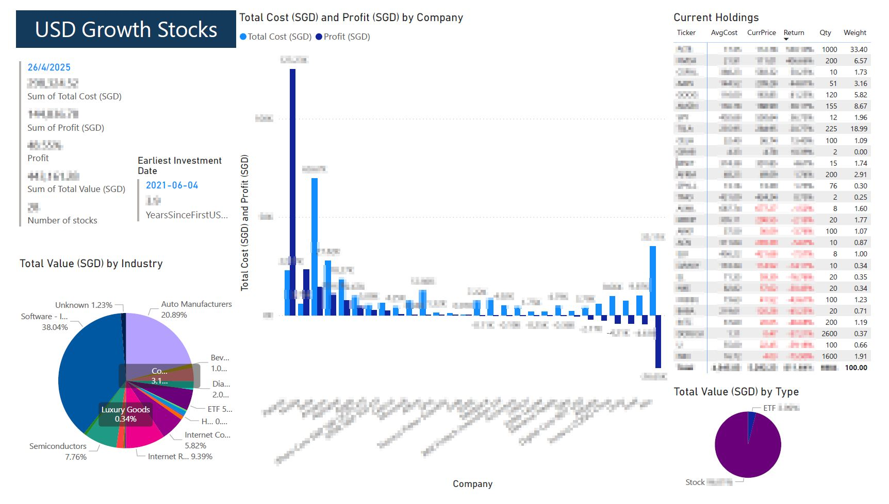
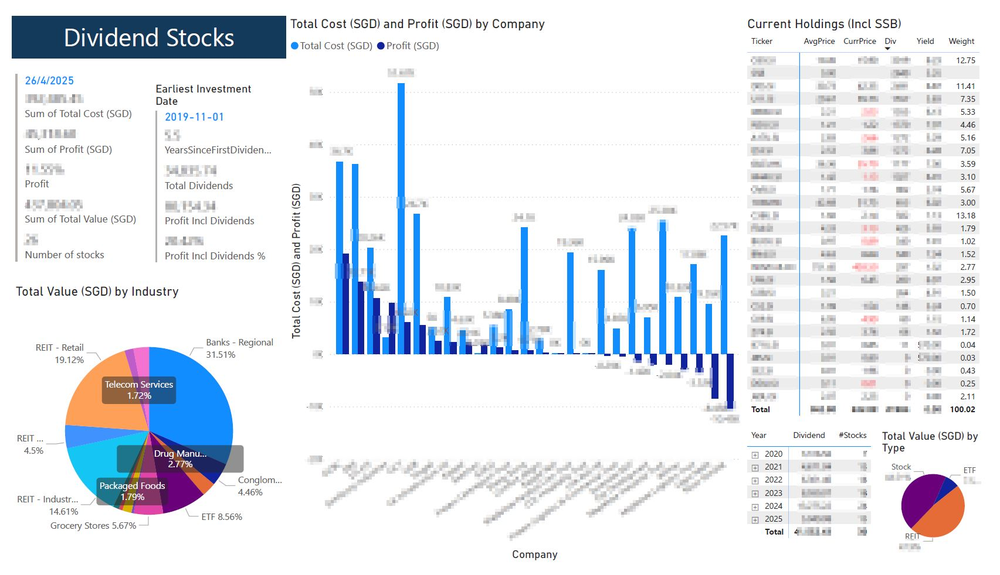
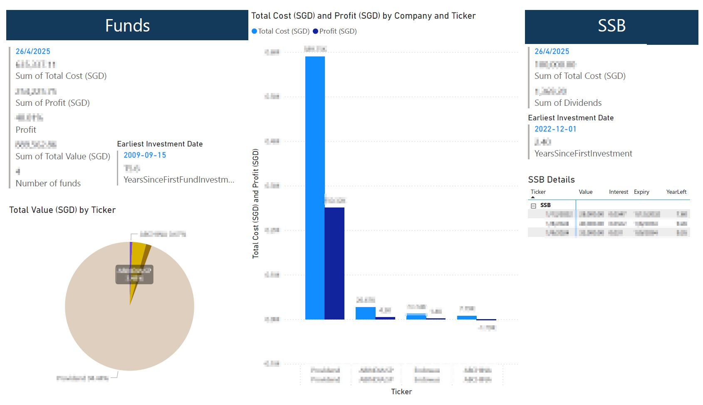
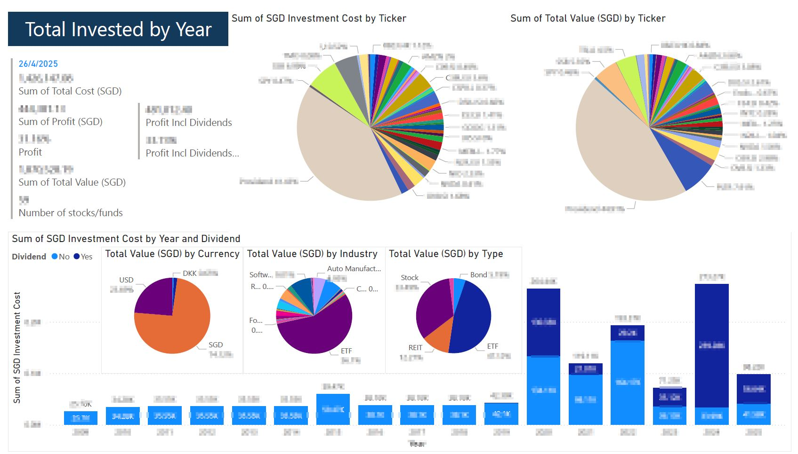

# 📈 Portfolio Tracker

A script to **automate portfolio summary** using the **`yfinance`** library.

 

The script summarizes a portfolio in **SGD**, fetching real-time **exchange rates** from Yahoo Finance during execution.

It aims to list:
- All holdings
- Current value
- Profit/loss
- Dividends received
- Other information such as industry classification

The **weightage** is calculated separately for **USD** and **Non-USD** stocks, as the non-USD portfolio is intended mainly for **dividend generation**.

---

## 📋 Requirements
- **Stock purchase transaction file**
- **Dividend record file**
- **[Optional] Private or in-house funds** from investment companies (for assets not listed on Yahoo Finance)

---

## 🛠 How It Works

- The script pulls **current stock prices** and **exchange rates** from Yahoo Finance.
- It computes the **market value**, **unrealized P&L**, **total dividends received**, and **portfolio allocation**.
- It handles missing data by allowing:
  - Manual input for **private/in-house funds** not available on Yahoo Finance.
  - Pre-set values for certain fields like **ETF industry classifications** when data is unavailable.

---

## 📚 Current Learning Points / Improvements

1. **SGX Stocks Retrieval Issue**  
   - Some **SGX stocks** cannot be fetched using the usual `yfinance.download()` method.  
   - Solution: Fetch prices individually using `Ticker.info['regularMarketPrice']`.

2. **ETF Industry Classification**  
   - The **`industry`** information for ETFs is often `null`.  
   - Solution: Use a **preset list** (`etf_tickers`) to manually assign industries.

---
---

## 📊 Dashboard Previews

<table>
  <tr>
    <td></td>
    <td></td>
  </tr>
  <tr>
    <td></td>
    <td></td>
  </tr>
</table>

